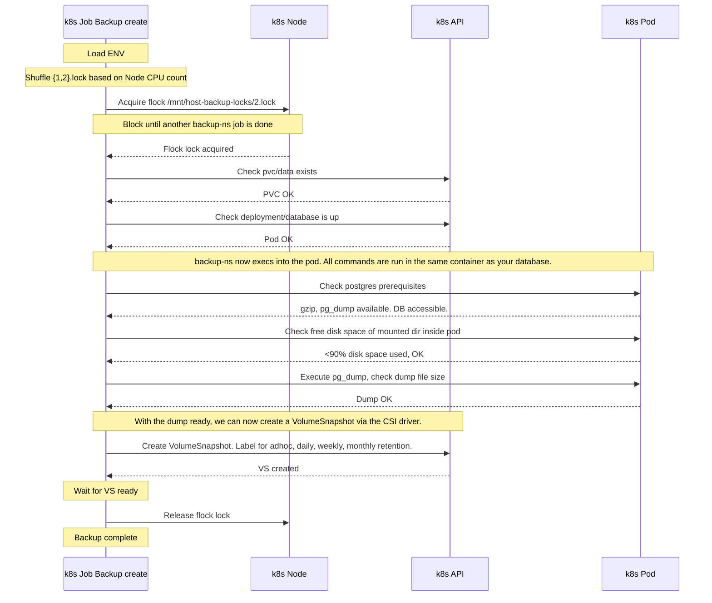
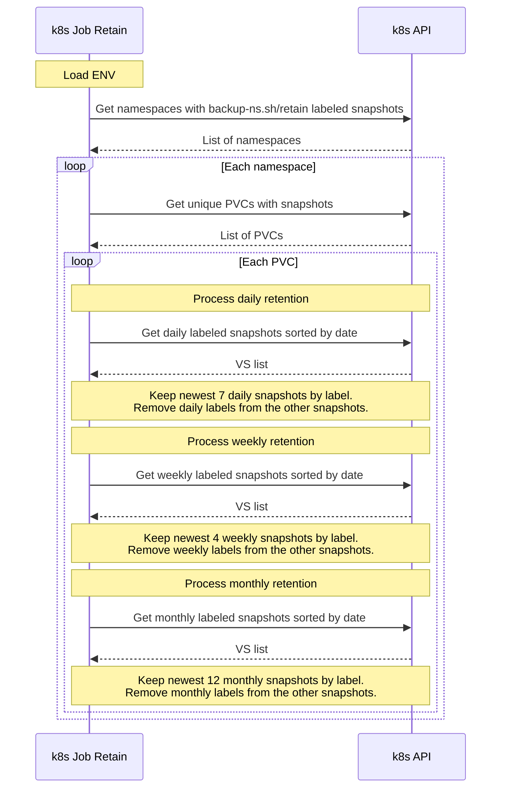
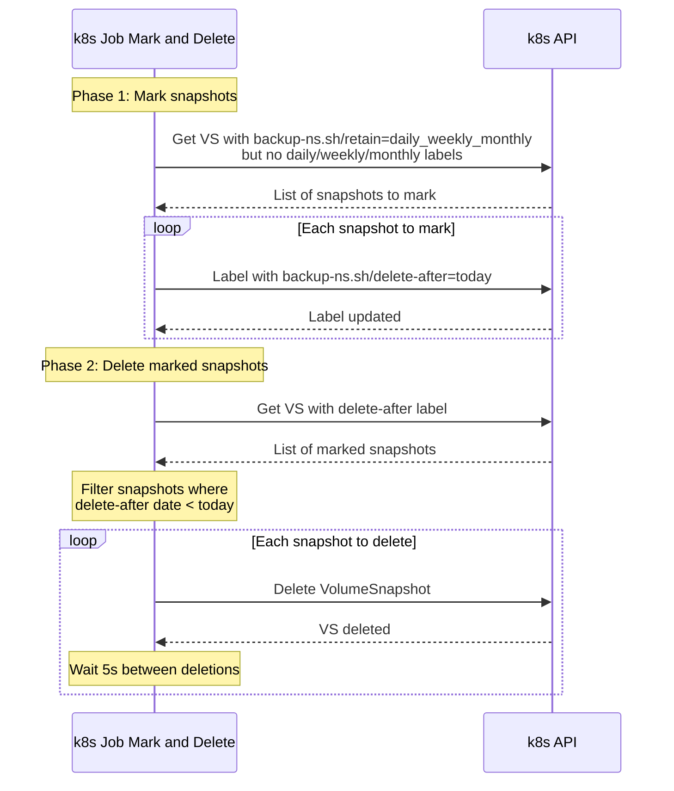

# backup-ns

- [backup-ns](#backup-ns)
  - [Introduction](#introduction)
  - [Usage](#usage)
    - [Install via static manifests](#install-via-static-manifests)
    - [Install via helm](#install-via-helm)
    - [Labels](#labels)
    - [Listing Snapshots](#listing-snapshots)
    - [Label Manipulation](#label-manipulation)
    - [ENV vars](#env-vars)
    - [`create-adhoc-backup.sh`: Create a new adhoc backup job](#create-adhoc-backupsh-create-a-new-adhoc-backup-job)
    - [Using `backup-ns` locally for triggering adhoc operations](#using-backup-ns-locally-for-triggering-adhoc-operations)
      - [Trigger an adhoc backup job](#trigger-an-adhoc-backup-job)
      - [Dump the postgres database on the live filesystem](#dump-the-postgres-database-on-the-live-filesystem)
      - [Download the postgres database dump to the local filesystem](#download-the-postgres-database-dump-to-the-local-filesystem)
      - [Restore the current dump of the postgres database on the live filesystem](#restore-the-current-dump-of-the-postgres-database-on-the-live-filesystem)
      - [Dump the mysql/mariadb database on the live filesystem](#dump-the-mysqlmariadb-database-on-the-live-filesystem)
      - [Download the mysql/mariadb database dump to the local filesystem](#download-the-mysqlmariadb-database-dump-to-the-local-filesystem)
      - [Restore the current dump of the mysql/mariadb database on the live filesystem](#restore-the-current-dump-of-the-mysqlmariadb-database-on-the-live-filesystem)
  - [Concepts](#concepts)
    - [Structure](#structure)
      - [Namespace-Specific](#namespace-specific)
      - [Global Controller](#global-controller)
    - [Application-aware backup creation](#application-aware-backup-creation)
    - [Label retention process](#label-retention-process)
    - [Mark and delete process](#mark-and-delete-process)
  - [Development](#development)
    - [Development Setup](#development-setup)
    - [Releasing new versions](#releasing-new-versions)
  - [Maintainers](#maintainers)
  - [License](#license)
  - [Alternatives](#alternatives)


## Introduction

This project combines Kubernetes CSI-based snapshots with application-aware (also called [application-consistent](https://cloud.google.com/compute/docs/disks/creating-linux-application-consistent-pd-snapshots)) creation mechanisms. It is designed to be used in a multi-tenant cluster environments where namespaces are used to separate different customer applications/environments. 

Current focus:
* Simple cli util for backup and restore without the need for operators or custom resource definitions (CRDs).
* Stick to the primitives. Just use k8s `CronJobs` for daily backup and handle retention with labels (`backup-ns.sh/`). 
* Focus on **PostgreSQL** and **MySQL/MariaDB** for now.
  * Using the proper compatible `mysqldump` and `pg_dump` is crucial when doing dumps.
  * By creating these dumps in the database container, compatibility is guaranteed.
* Control backup job concurrency on the node-level via flock.
* Mark and sweep like handling, giving you time between marking the volume snapshot for deletion and actual deletion.
* Low-dependency, only requires `kubectl` to be in `PATH`
* The `backup-ns` binary can be used locally to:
  * list / filter backups,
  * trigger adhoc volume snapshots,
  * create, restore, download database dumps.

## Usage

### Install via static manifests

The project is split into two main manifest files:

* [`deploy/static/backup-ns-controller.yaml`](deploy/static/backup-ns-controller.yaml) - Global controller components, the ClusterRole and CronJobs for retention and pruning.
* [`deploy/static/backup-ns.yaml`](deploy/static/backup-ns.yaml) - Namespace-specific components, must be deployed in each namespace where you want to run the backup-ns operation.

Download, modify and install the global controller components first (`kubectl apply -f backup-ns-controller.yaml`) and then modify and deploy as many namespace-specific manifests as you need (`kubectl apply -f backup-ns.yaml`).

### Install via helm

Only the namespace-specifc components are currently available via helm.  
The global controller components must be deployed via static manifests.

See https://code.allaboutapps.at/backup-ns/ for the latest helm chart and [`charts/backup-ns/values.yaml`](charts/backup-ns/values.yaml) for the default values.


### Labels

backup-ns uses the following label categories:

- **Retention Labels**
  - `backup-ns.sh/daily="YYYY-MM-DD"`
  - `backup-ns.sh/weekly="w04"`
  - `backup-ns.sh/monthly="YYYY-MM"`
- **Management Labels** 
  - `backup-ns.sh/delete-after="YYYY-MM-DD"` (marks snapshot for deletion)
  - `backup-ns.sh/retain` (general retention flag)
  - `backup-ns.sh/type` (backup type identifier)

### Listing Snapshots

The `backup-ns list` command provides convenient filtering:

```bash
# Install the backup-ns binary locally
# See https://github.com/allaboutapps/backup-ns/releases for cli installation instructions.

# Basic listing
backup-ns list           # Current namespace
backup-ns list -A        # All namespaces

# Filter by retention type
backup-ns list --daily
backup-ns list --weekly  
backup-ns list --monthly
backup-ns list --adhoc

# Sample output
backup-ns list
# Namespace: go-starter-dev
# Listing volume snapshots with labels: backup-ns.sh/retain
# NAME                            SNAPSHOTCONTENT      CREATIONTIME   AGE     TYPE      RETAIN                 DAILY        WEEKLY   MONTHLY   DELETE-AFTER
# data-2024-04-17-001946-s6bah4   snapcontent-aa164b   267d           267d    cronjob   daily_weekly_monthly                         2024-04
# data-2024-05-01-001827-atxtnf   snapcontent-00b33a   253d           253d    cronjob   daily_weekly_monthly                         2024-05
# data-2024-06-01-001959-7osghz   snapcontent-1a5a50   222d           222d    cronjob   daily_weekly_monthly                         2024-06
# data-2024-07-01-001713-xm0gxn   snapcontent-61dfe0   192d           192d    cronjob   daily_weekly_monthly                         2024-07
# data-2024-08-01-001708-7l3q5d   snapcontent-3a54f5   161d           161d    cronjob   daily_weekly_monthly                         2024-08
# data-2024-09-01-001759-aw132j   snapcontent-202c12   130d           130d    cronjob   daily_weekly_monthly                         2024-09
# data-2024-10-01-001717-hi2hb6   snapcontent-d0d009   100d           100d    cronjob   daily_weekly_monthly                         2024-10
# data-2024-11-01-003135-fppref   snapcontent-2ddcb5   69d            69d     cronjob   daily_weekly_monthly                         2024-11
# data-2024-12-01-001746-kbxebe   snapcontent-fabf33   39d            39d     cronjob   daily_weekly_monthly                         2024-12
# data-2024-12-17-144438-otsedc   snapcontent-7677a5   23d            23d     adhoc     days                                                   2025-01-16
# data-2024-12-23-001716-teefnb   snapcontent-89b2b7   17d            17d     cronjob   daily_weekly_monthly                w52
# data-2024-12-30-002012-izgqoi   snapcontent-3aa08d   10d            10d     cronjob   daily_weekly_monthly                w53
# data-2025-01-01-001709-sivtji   snapcontent-d30758   8d             8d      cronjob   daily_weekly_monthly                w01      2025-01
# data-2025-01-02-001754-ntwghm   snapcontent-d9c9ff   7d17h          7d17h   cronjob   daily_weekly_monthly                                   2025-01-09
# data-2025-01-03-001757-vsgkkc   snapcontent-2d7844   6d17h          6d17h   cronjob   daily_weekly_monthly   2025-01-03
# data-2025-01-04-001759-bfzceo   snapcontent-4d6b12   5d17h          5d17h   cronjob   daily_weekly_monthly   2025-01-04
# data-2025-01-05-002023-quvkyv   snapcontent-a7a4a3   4d17h          4d17h   cronjob   daily_weekly_monthly   2025-01-05
# data-2025-01-06-003219-meaukv   snapcontent-08a8eb   3d16h          3d16h   cronjob   daily_weekly_monthly   2025-01-06   w02
# data-2025-01-07-003037-wmkylm   snapcontent-6b2c92   2d16h          2d16h   cronjob   daily_weekly_monthly   2025-01-07
# data-2025-01-07-182742-fgztxg   snapcontent-952208   46h            46h     adhoc     days                                                   2025-02-06
# data-2025-01-08-001706-crlfxa   snapcontent-a7416f   41h            41h     cronjob   daily_weekly_monthly   2025-01-08
# data-2025-01-08-180009-yjculw   snapcontent-e3dc13   23h            23h     adhoc     days                                                   2025-02-07
# data-2025-01-09-001749-vfyfeu   snapcontent-7ed61b   17h            17h     cronjob   daily_weekly_monthly   2025-01-09
```

Advanced listing using `kubectl` directly:

```bash
# Under the hook the above list commands directly translate to kubectl get commands.
# It's all based on labels. Feel free to use kubectl directly for more advanced queries.

# List all application-aware snapshots
kubectl get vs -lbackup-ns.sh/retain \
  -Lbackup-ns.sh/type,backup-ns.sh/retain,backup-ns.sh/daily,backup-ns.sh/weekly,backup-ns.sh/monthly,backup-ns.sh/delete-after \
  --all-namespaces

# List snapshots marked for deletion
kubectl get vs --all-namespaces \
  -l"backup-ns.sh/delete-after" \
  -Lbackup-ns.sh/retain,backup-ns.sh/daily,backup-ns.sh/weekly,backup-ns.sh/monthly,backup-ns.sh/delete-after
```

### Label Manipulation

```bash
# Add a specific deleteAfter label (the pruner will delete the vs after the specified date)!
kubectl label vs/<vs> "backup-ns.sh/delete-after"="YYYY-MM-DD"  # Add

# Remove a deleteAfter labeled vs (this prevents the backup-ns pruner from deleting the vs):
kubectl label vs/<vs> "backup-ns.sh/delete-after"-              # Remove

# Remove retain based labels if they should no longer count to our policy
kubectl label vs/<vs> "backup-ns.sh/daily"-
kubectl label vs/<vs> "backup-ns.sh/weekly"-
kubectl label vs/<vs> "backup-ns.sh/monthly"-

# Add a specific label daily/weekly/monthly (typically done by the backup-ns cronjob directly, normally not needed)
kubectl label vs/<vs> "backup-ns.sh/daily"="YYYY-MM-DD"
kubectl label vs/<vs> "backup-ns.sh/weekly"="w04"
kubectl label vs/<vs> "backup-ns.sh/monthly"="YYYY-MM"
```

### ENV vars

See [internal/lib/bak_env.go](internal/lib/bak_env.go) for all available ENV vars (`BAK_*`) and their default values.

### `create-adhoc-backup.sh`: Create a new adhoc backup job

Sometimes it is necessary to **manually** create an adhoc volume snapshot that is not part of the normal retention logic (but instead auto-deleted after 30 days). This can be done by by using the namespaced `backup` cronjob as template for creating a new k8s adhoc backup job and overwriting the new `ENV` vars.

The `create-adhoc-backup.sh` script is a utility to do this easily.

```bash
# Install the create-adhoc-backup.sh bash script locally
# See https://github.com/allaboutapps/backup-ns/releases for cli installation instructions.

# Run the create adhoc backup script. This will assume that there is a `backup` cronjob in the kubectl context namespace that is used as a base.
./create-adhoc-backup.sh
# Creating adhoc backup in ns=go-starter-dev...
# Prepared backup command:
# kubectl create job --from=cronjob.batch/backup "backup-adhoc-2025-01-08-155614" -o yaml --dry-run=client -n "go-starter-dev"  | yq eval '.spec.template.spec.containers[0].env += [{"name": "BAK_LABEL_VS_RETAIN", "value": "days"}]' - | yq eval '.spec.template.spec.containers[0].env += [{"name": "BAK_LABEL_VS_TYPE", "value": "adhoc"}]' - | kubectl apply -f -
# Ensuring there is no other backup job running within ns=go-starter-dev...
# Creating job/backup-adhoc-2025-01-08-155614 for ns=go-starter-dev...
# job.batch/backup-adhoc-2025-01-08-155614 created
# Follow logs with:
#   kubectl logs -n go-starter-dev -f job/backup-adhoc-2025-01-08-155614
# Waiting for backup job/backup-adhoc-2025-01-08-155614 to complete for ns=go-starter-dev...
# job.batch/backup-adhoc-2025-01-08-155614 condition met

# List all snapshots in this namespace via:
# kubectl -n go-starter-dev get vs -lbackup-ns.sh/retain -Lbackup-ns.sh/type,backup-ns.sh/retain,backup-ns.sh/daily,backup-ns.sh/weekly,backup-ns.sh/monthly,backup-ns.sh/delete-after

# Adhoc backups are only kept for 30days by default, you can delete this auto-retention flag manually by running:
# kubectl -n go-starter-dev label vs/<snapshot-name> backup-ns.sh/retain- backup-ns.sh/delete-after-
```

### Using `backup-ns` locally for triggering adhoc operations

It's also possible to run the `backup-ns` cli tool locally to create new adhoc backup jobs or work with database dumps. To easily get the currently used ENV vars from the backup cronjob and overwriting them, install the [`kubectl envx`](https://github.com/majodev/kubectl-envx) plugin.

The `backup-ns` binary must furthermore be available locally so it can interact with `kubectl` directly. 

```bash
# Install the backup-ns binary locally
# See https://github.com/allaboutapps/backup-ns/releases for cli installation instructions.

# Install the kubectl envx plugin
kubectl krew envx install

# Show the current ENV vars of the backup-ns cronjob
kubectl envx cronjob/backup
# BAK_DB_POSTGRES=true
# BAK_FLOCK=true
# BAK_LABEL_VS_RETAIN=daily_weekly_monthly
# BAK_LABEL_VS_TYPE=cronjob
# BAK_NAMESPACE=go-starter-dev
# BAK_LABEL_VS_POD=backup
# TZ=Europe/Vienna
```

#### Trigger an adhoc backup job

```bash
# same ENV vars as the backup cronjob, but:
# * disabling flock file locking (prevents concurrent backup creating of multiple namespaces on the same node)
# * change the backup type to adhoc and
# * and set retain to days (defaults to 30 days, after that the backup will be auto-deleted)
kubectl envx cronjob/backup BAK_LABEL_VS_TYPE=adhoc BAK_FLOCK=false BAK_LABEL_VS_RETAIN=days -- backup-ns create
# 2025/01/08 16:43:08 VS Name: data-2025-01-08-164308-dcdkes
# 2025/01/08 16:43:08 Checking if PVC 'data' exists in namespace 'go-starter-dev'...
# 2025/01/08 16:43:08 PVC 'data' is available in namespace 'go-starter-dev'.
# 2025/01/08 16:43:08 Checking if resource 'deployment/app-base' exists in namespace 'go-starter-dev'...
# 2025/01/08 16:43:09 Resource 'deployment/app-base' is available in namespace 'go-starter-dev'.
# 2025/01/08 16:43:09 Checking if Postgres is available in namespace 'go-starter-dev'...
# 2025/01/08 16:43:10 Checking free space on /var/lib/postgresql/data in namespace 'go-starter-dev'...
# 2025/01/08 16:43:11 Free space check succeeded. Used: 2%, Threshold: 90%.
# 2025/01/08 16:43:14 Templated script 'postgres_dump.sh.tmpl' completed.
# 2025/01/08 16:43:14 Finished postgres dump in namespace='go-starter-dev'!
# 2025/01/08 16:43:14 Creating VolumeSnapshot 'data-2025-01-08-164308-dcdkes' in namespace 'go-starter-dev'...
# 2025/01/08 16:43:15 Waiting for VolumeSnapshot 'data-2025-01-08-164308-dcdkes' to be ready (timeout: 15m)...
# 2025/01/08 16:43:41 Finished backup vs_name='data-2025-01-08-164308-dcdkes' in namespace='go-starter-dev'!
```

#### Dump the postgres database on the live filesystem

```bash
kubectl envx cronjob/backup -- backup-ns postgres dump
# 2025/01/08 16:49:30 Checking if resource 'deployment/app-base' exists in namespace 'go-starter-dev'...
# 2025/01/08 16:49:31 Resource 'deployment/app-base' is available in namespace 'go-starter-dev'. Output:
# 2025/01/08 16:49:31 Checking if Postgres is available in namespace 'go-starter-dev'...
# 2025/01/08 16:49:32 Templated script 'postgres_check.sh.tmpl' completed. 
# 2025/01/08 16:49:32 Checking free space on /var/lib/postgresql/data in namespace 'go-starter-dev'...
# 2025/01/08 16:49:33 Free space check succeeded. Used: 2%, Threshold: 90%. Output:
# 2025/01/08 16:49:33 Backing up Postgres database '${POSTGRES_DB}' in namespace 'go-starter-dev'...
# 2025/01/08 16:49:35 Templated script 'postgres_dump.sh.tmpl' completed. Output:
# + trap 'exit_code=$?; [ $exit_code -ne 0 ] && echo "TRAP!" && rm -f /var/lib/postgresql/data/dump.sql.gz && df -h /var/lib/postgresql/data; exit $exit_code' EXIT
# + trap 'trap - SIGTERM && kill -- -$$' SIGTERM SIGPIPE
# + pg_dump --username=dbuser --format=p --clean --if-exists go-starter-dev --host 127.0.0.1 --port 5432
# + gzip -c
# + ls -lha /var/lib/postgresql/data/dump.sql.gz
# + '[' -s /var/lib/postgresql/data/dump.sql.gz ']'
# -rw-r--r--    1 postgres root       21.3K Jan  8 15:49 /var/lib/postgresql/data/dump.sql.gz
# + df -h /var/lib/postgresql/data
# Filesystem                Size      Used Available Use% Mounted on
# /dev/sdc                  9.7G    177.4M      9.6G   2% /var/lib/postgresql/data
# + exit_code=0
# + '[' 0 -ne 0 ']'
# + exit 0
# 2025/01/08 16:49:35 Finished postgres dump in namespace='go-starter-dev'!
```

#### Download the postgres database dump to the local filesystem

```bash
kubectl envx cronjob/backup -- backup-ns postgres downloadDump
# 2025/01/09 15:30:51 Checking if resource 'deployment/app-base' exists in namespace 'go-starter-dev'...
# 2025/01/09 15:30:52 Resource 'deployment/app-base' is available in namespace 'go-starter-dev'.
# 2025/01/09 15:30:52 Checking if Postgres is available in namespace 'go-starter-dev'...
# 2025/01/09 15:30:53 Templated script 'postgres_check.sh.tmpl' completed. 
# [...]
# + ls -lha /var/lib/postgresql/data/dump.sql.gz
# -rw-r--r--    1 postgres root       21.3K Jan  8 23:17 /var/lib/postgresql/data/dump.sql.gz
# 2025/01/09 15:30:56 Downloading postgres dump from namespace='go-starter-dev' to go-starter-dev_2025-01-08T23-17-50Z_postgres_dump.tar.gz
# 2025/01/09 15:30:57 Successfully downloaded dump file (size: 21791 bytes)
# 2025/01/09 15:30:57 to unpack:
# gzip -dc go-starter-dev_2025-01-08T23-17-50Z_postgres_dump.tar.gz > dump.sql
# 2025/01/09 15:30:57 to import:
# gzip -dc go-starter-dev_2025-01-08T23-17-50Z_postgres_dump.tar.gz | psql --host 127.0.0.1 --port 5432 --username=${POSTGRES_USER} ${POSTGRES_DB}
```

#### Restore the current dump of the postgres database on the live filesystem

```bash
kubectl envx cronjob/backup -- backup-ns postgres restore
# 2025/01/08 16:53:58 Checking if resource 'deployment/app-base' exists in namespace 'go-starter-dev'...
# 2025/01/08 16:53:58 Resource 'deployment/app-base' is available in namespace 'go-starter-dev'. Output:
# 2025/01/08 16:53:58 Checking if Postgres is available in namespace 'go-starter-dev'...
# 2025/01/08 16:53:59 Templated script 'postgres_check.sh.tmpl' completed. 
# 2025/01/08 16:53:59 Restoring Postgres database '${POSTGRES_DB}' in namespace 'go-starter-dev'...
# 2025/01/08 16:54:00 Templated script 'postgres_restore.sh.tmpl' completed. Output:
# + '[' -s /var/lib/postgresql/data/dump.sql.gz ']'
# + ls -lha /var/lib/postgresql/data/dump.sql.gz
# -rw-r--r--    1 postgres root       21.3K Jan  8 15:49 /var/lib/postgresql/data/dump.sql.gz
# + gzip -dc /var/lib/postgresql/data/dump.sql.gz
# + psql --host 127.0.0.1 --port 5432 --username=dbuser go-starter-dev
# SET
# [...]
# DROP INDEX
# ALTER TABLE
# DROP TABLE
# DROP SEQUENCE
# DROP TYPE
# DROP EXTENSION
# CREATE EXTENSION
# COMMENT
# CREATE TYPE
# ALTER TYPE
# CREATE TYPE
# ALTER TYPE
# SET
# [...]
# COPY 137
# 2025/01/08 16:54:00 Finished postgres restore in namespace='go-starter-dev'!
```

#### Dump the mysql/mariadb database on the live filesystem

```bash
kubectl envx cronjob/backup -- backup-ns mysql dump
```

#### Download the mysql/mariadb database dump to the local filesystem

```bash
kubectl envx cronjob/backup -- backup-ns mysql downloadDump
```

#### Restore the current dump of the mysql/mariadb database on the live filesystem

```bash
kubectl envx cronjob/backup -- backup-ns mysql restore
```

## Concepts

This section describes the structure and various processes of the backup-ns project.

### Structure

#### Namespace-Specific

[`deploy/static/backup-ns.yaml`](deploy/static/backup-ns.yaml)

- **ConfigMap** `backup-env`: Configuration for backup behavior
  - Controls database type (MySQL/PostgreSQL)
  - Backup retention settings
  - Lock mechanism configuration
- **ServiceAccount** `backup-ns`: For running backup jobs
- **RoleBinding**: Links to cluster-wide permissions
- **CronJob** `backup`:
  - Daily backup execution
  - Uses flock for cross-node concurrency control
  - Performs database dumps and volume snapshots

#### Global Controller

[`deploy/static/backup-ns-controller.yaml`](deploy/static/backup-ns-controller.yaml)

- Runs in a dedicated **namespace** `backup-ns`, controls retention and pruning for all namespaces with volume snapshots with `backup-ns.sh/` labels.
- **ClusterRole** `backup-ns`: Defines permissions for namespace backups
  - Pod/PVC access
  - Volume snapshot operations
- **ClusterRole** `backup-ns-controller`: Global snapshot management (pruning, retention)
- **ServiceAccount** `backup-ns-controller`
- **ClusterRoleBinding**: Global snapshot management permissions
- **CronJobs**:
  1. `sync-volume-snapshot-labels`: Runs daily to sync metadata
  2. `pruner`: Handles snapshot retention and cleanup

### Application-aware backup creation

Application-aware currently means to ensure the DB is dumped on the same disk before the volume snapshot is taken. This handling is implemented for PostgreSQL and MySQL/MariaDB. In the future, this could be extended to other applications that require special handling before a snapshot is taken. Having a custom script target might also be an option.

> If you are interested in adding support for another database, please open an issue or PR.
> See [/templates](internal/lib/templates) and [postgres.go](internal/lib/postgres.go) how this is implemented currently.

This diagram shows the process of a backup job for a PostgreSQL database. The same is possible with MySQL or by entirely skipping the database.



### Label retention process

This diagram shows how the retention process works for managing snapshots based on daily, weekly and monthly policies. This process is typically run globally, but can also be run on a per-namespace basis (as to how the RBAC service account allows access).



### Mark and delete process

Volume snapshots that have lost all retention-related labels will be marked for deletion and subsequently deleted. This diagram shows that. Like the retain process, this process is typically run globally, but can also be run on a per-namespace basis (as to how the RBAC service account allows access).



## Development

### Development Setup

Requires the following local setup for development:

- [Docker CE](https://docs.docker.com/install/) (19.03 or above)
- [Docker Compose](https://docs.docker.com/compose/install/) (1.25 or above)
- [kind (Kubernetes in Docker)](https://kind.sigs.k8s.io/)
- [VSCode Extension: Remote - Containers](https://code.visualstudio.com/docs/remote/containers) (`ms-vscode-remote.remote-containers`)

This project makes use of the [Remote - Containers extension](https://code.visualstudio.com/docs/remote/containers) provided by [Visual Studio Code](https://code.visualstudio.com/). A local installation of the Go tool-chain is **no longer required** when using this setup.

Please refer to the [official installation guide](https://code.visualstudio.com/docs/remote/containers) how this works for your host OS and head to our [FAQ: How does our VSCode setup work?](https://github.com/allaboutapps/go-starter/wiki/FAQ#how-does-our-vscode-setup-work) if you encounter issues.

We test the functionality of the backup-ns tool against a [kind (Kubernetes in Docker)](https://kind.sigs.k8s.io/) cluster.

```bash
# Ensure you have docker (for mac) and kind installed on your **local** host.
# This project requires kind (Kubernetes in Docker) to do the testing.

# Launch a new kind cluster on your *LOCAL* host:
brew install kind
make kind-cluster-init

# the dev container is autoconfigured to use the above kind cluster
./docker-helper --up

development@f4a7ad3b5e3d:/app$ k get nodes
# NAME                      STATUS   ROLES           AGE   VERSION
# backup-ns-control-plane   Ready    control-plane   69s   v1.28.13
development@f4a7ad3b5e3d:/app$ k version
# Client Version: v1.28.14
# Kustomize Version: v5.0.4-0.20230601165947-6ce0bf390ce3
# Server Version: v1.28.13
development@f4a7ad3b5e3d:/app$ make all

# Print all available make targets
development@f4a7ad3b5e3d:/app$ make help

# Shortcut for make init, make build, make info and make test
development@f4a7ad3b5e3d:/app$ make all

# Init install/cache dependencies and install tools to bin
development@f4a7ad3b5e3d:/app$ make init

# Rebuild only after changes to files
development@f4a7ad3b5e3d:/app$ make

# Execute all tests
development@f4a7ad3b5e3d:/app$ make test

# Watch pipeline (rebuilds all after any change)
development@f4a7ad3b5e3d:/app$ make watch
```

### Releasing new versions

This project uses GitHub Actions to build and push the Docker image to the GitHub Container Registry.  
Auto-Publish is active for the `dev` and `main` branch.

The `helm/chart-releaser-action` ensures that the Helm chart is published to the GitHub Pages branch.

To deploy a new app and chart version:
* Bump the `version` (for the chart) and `appVersion` (for the docker image) in the `charts/backup-ns/Chart.yaml` file and push to `main`.
* Create a new git tag with the above `appVersion` (e.g. `git tag -a v0.1.1 -m "v0.1.1"` ) and push it to the GitHub repository.

## Maintainers

- [Mario Ranftl - @majodev](https://github.com/majodev)

## License

[MIT](LICENSE) © 2024-2025 aaa – all about apps GmbH | Mario Ranftl and the backup-ns project contributors

## Alternatives

* [backube/snapscheduler](https://github.com/backube/snapscheduler): Based on CSI snapshots, but using CRDs and without the option to do application consistent snapshots (no pre/post hooks).
* [FairwindsOps/gemini](https://github.com/FairwindsOps/gemini): Very similar to snapscheduler (CRDs + CSI based snapshots), different scheduling and retention handling.
* [k8up-io/k8up](https://github.com/k8up-io/k8up): Based on Restic, requires launching pods with direct access to the PVC to backup and custom CRDs.
* [vmware-tanzu/velero](https://github.com/vmware-tanzu/velero): Global cluster disaster recovery (difficult to target singular namespaces) and custom CRDs.