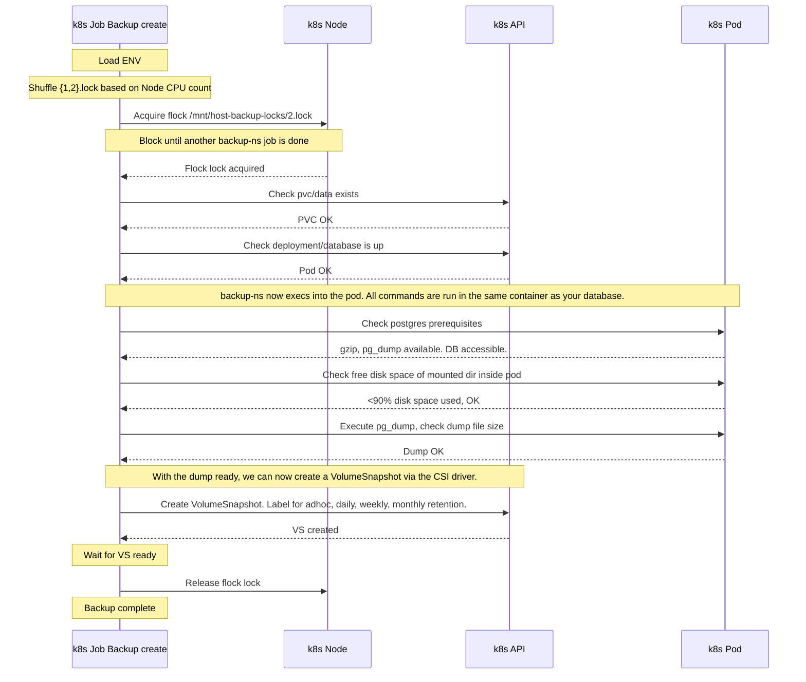
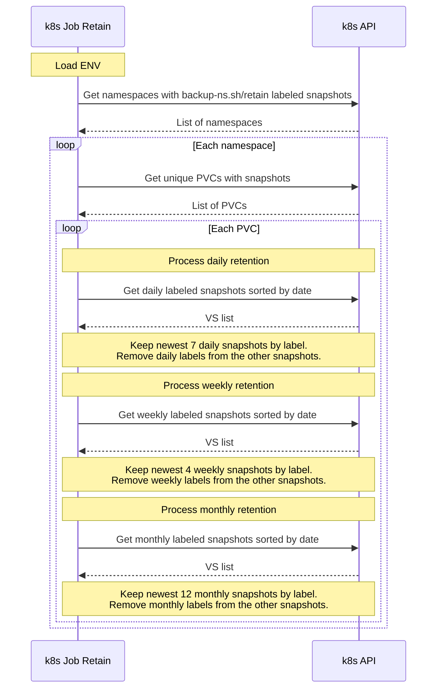
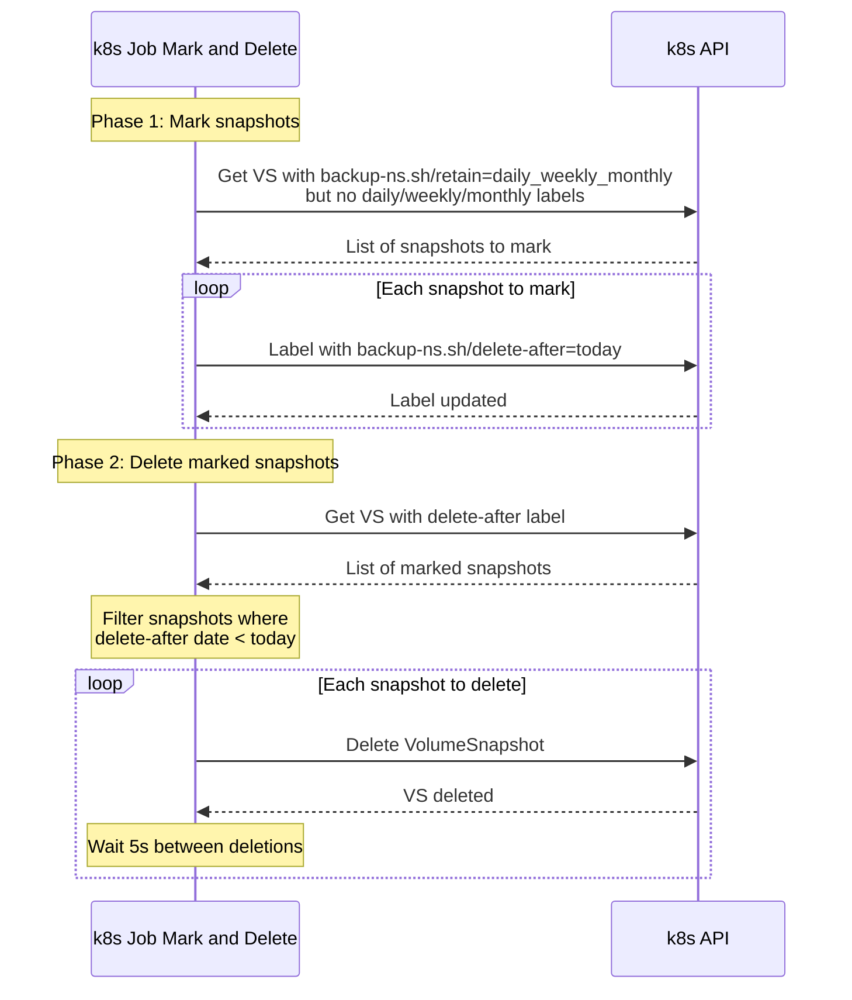

# backup-ns

- [backup-ns](#backup-ns)
  - [Introduction](#introduction)
  - [Usage](#usage)
    - [Install via static manifests](#install-via-static-manifests)
    - [Install via helm](#install-via-helm)
    - [Labels](#labels)
  - [Concepts](#concepts)
    - [Structure](#structure)
      - [Namespace-Specific](#namespace-specific)
      - [Global Controller](#global-controller)
    - [Application-aware backup creation](#application-aware-backup-creation)
    - [Label retention process](#label-retention-process)
    - [Mark and delete process](#mark-and-delete-process)
  - [Development](#development)
    - [Development Setup](#development-setup)
    - [Releasing new versions](#releasing-new-versions)
  - [Maintainers](#maintainers)
  - [License](#license)
  - [Alternatives](#alternatives)


## Introduction

This project combines Kubernetes CSI-based snapshots with application-aware (also called application-consistent) creation mechanisms. It is designed to be used in a multi-tenant cluster environments where namespaces are used to separate different customer applications/environments. 

Current focus:
* Simple cli util for backup and restore without the need for operators or custom resource definitions (CRDs).
* Using the proper compatible `mysqldump` and `pg_dump` is crucial when doing dumps! By executing these dumps in the same pod as the database container, compatibility is guaranteed.
* Stick to the primitives. Just use k8s `CronJobs` for daily backup and handle retention with labels (`backup-ns.sh/`). 
* Control backup job concurrency on the node-level via flock.
* Mark and sweep like handling, giving you time between marking the volume snapshot for deletion and actual deletion.
* Low-dependency, only requires `kubectl` to be in `PATH`.

## Usage

### Install via static manifests

The project is split into two main manifest files:

* [`deploy/static/backup-ns-controller.yaml`](deploy/static/backup-ns-controller.yaml) - Global controller components, the ClusterRole and CronJobs for retention and pruning.
* [`deploy/static/backup-ns.yaml`](deploy/static/backup-ns.yaml) - Namespace-specific components, must be deployed in each namespace where you want to run the backup-ns operation.

Download, modify and install the global controller components first (`kubectl apply -f backup-ns-controller.yaml`) and then modify and deploy as many namespace-specific manifests as you need (`kubectl apply -f backup-ns.yaml`).

### Install via helm

Only the namespace-specifc components are currently available via helm.  
The global controller components must be deployed via static manifests.

See https://code.allaboutapps.at/backup-ns/ for the latest helm chart and [`charts/backup-ns/values.yaml`](charts/backup-ns/values.yaml) for the default values.


### Labels

Here are some typical labels backup-ns currently uses for creating and retaining the volume snapshots and how to manipulate them manually:

```bash
# Remove a deleteAfter labeled vs (this prevents the backup-ns pruner from deleting the vs):
kubectl label vs/<vs> "backup-ns.sh/delete-after"-

# Remove a specific label for daily/weekly/monthly retention
kubectl label vs/<vs> "backup-ns.sh/daily"-
kubectl label vs/<vs> "backup-ns.sh/weekly"-
kubectl label vs/<vs> "backup-ns.sh/monthly"-

# Add a specific label daily/weekly/monthly
kubectl label vs/<vs> "backup-ns.sh/daily"="YYYY-MM-DD"
kubectl label vs/<vs> "backup-ns.sh/weekly"="w04"
kubectl label vs/<vs> "backup-ns.sh/monthly"="YYYY-MM"

# Add a specific deleteAfter label (the pruner will delete the vs after the specified date)!
kubectl label vs/<vs> "backup-ns.sh/delete-after"="YYYY-MM-DD"
```

Here are some typical volume snapshot list commands based on that labels:

```bash
# List application-aware volume snapshots overview all namespaces
kubectl get vs -lbackup-ns.sh/retain -Lbackup-ns.sh/type,backup-ns.sh/retain,backup-ns.sh/daily,backup-ns.sh/weekly,backup-ns.sh/monthly,backup-ns.sh/delete-after --all-namespaces

# Filter by daily, weekly, monthly:
kubectl get vs -lbackup-ns.sh/retain,backup-ns.sh/daily -Lbackup-ns.sh/retain,backup-ns.sh/daily,backup-ns.sh/weekly,backup-ns.sh/monthly --all-namespaces
kubectl get vs -lbackup-ns.sh/retain,backup-ns.sh/weekly -Lbackup-ns.sh/retain,backup-ns.sh/daily,backup-ns.sh/weekly,backup-ns.sh/monthly --all-namespaces
kubectl get vs -lbackup-ns.sh/retain,backup-ns.sh/monthly -Lbackup-ns.sh/retain,backup-ns.sh/daily,backup-ns.sh/weekly,backup-ns.sh/monthly --all-namespaces

# Filter for marked for deletion snapshots
kubectl get vs --all-namespaces -l"backup-ns.sh/delete-after" -Lbackup-ns.sh/retain,backup-ns.sh/daily,backup-ns.sh/weekly,backup-ns.sh/monthly,backup-ns.sh/delete-after
```

## Concepts

This section describes the structure and various processes of the backup-ns project.

### Structure

#### Namespace-Specific

[`deploy/static/backup-ns.yaml`](deploy/static/backup-ns.yaml)

- **ConfigMap** `backup-env`: Configuration for backup behavior
  - Controls database type (MySQL/PostgreSQL)
  - Backup retention settings
  - Lock mechanism configuration
- **ServiceAccount** `backup-ns`: For running backup jobs
- **RoleBinding**: Links to cluster-wide permissions
- **CronJob** `backup`:
  - Daily backup execution
  - Uses flock for cross-node concurrency control
  - Performs database dumps and volume snapshots

#### Global Controller

[`deploy/static/backup-ns-controller.yaml`](deploy/static/backup-ns-controller.yaml)

- Runs in a dedicated **namespace** `backup-ns`, controls retention and pruning for all namespaces with volume snapshots with `backup-ns.sh/` labels.
- **ClusterRole** `backup-ns`: Defines permissions for namespace backups
  - Pod/PVC access
  - Volume snapshot operations
- **ClusterRole** `backup-ns-controller`: Global snapshot management (pruning, retention)
- **ServiceAccount** `backup-ns-controller`
- **ClusterRoleBinding**: Global snapshot management permissions
- **CronJobs**:
  1. `sync-volume-snapshot-labels`: Runs daily to sync metadata
  2. `pruner`: Handles snapshot retention and cleanup

### Application-aware backup creation

This diagram shows the process of a backup job for a PostgreSQL database. The same is possible with MySQL or by entirely skipping the database.



### Label retention process

This diagram shows how the retention process works for managing snapshots based on daily, weekly and monthly policies. This process is typically run globally, but can also be run on a per-namespace basis (as to how the RBAC service account allows access).



### Mark and delete process

Volume snapshots that have lost all retention-related labels will be marked for deletion and subsequently deleted. This diagram shows that. Like the retain process, this process is typically run globally, but can also be run on a per-namespace basis (as to how the RBAC service account allows access).



## Development

### Development Setup

Requires the following local setup for development:

- [Docker CE](https://docs.docker.com/install/) (19.03 or above)
- [Docker Compose](https://docs.docker.com/compose/install/) (1.25 or above)
- [kind (Kubernetes in Docker)](https://kind.sigs.k8s.io/)
- [VSCode Extension: Remote - Containers](https://code.visualstudio.com/docs/remote/containers) (`ms-vscode-remote.remote-containers`)

This project makes use of the [Remote - Containers extension](https://code.visualstudio.com/docs/remote/containers) provided by [Visual Studio Code](https://code.visualstudio.com/). A local installation of the Go tool-chain is **no longer required** when using this setup.

Please refer to the [official installation guide](https://code.visualstudio.com/docs/remote/containers) how this works for your host OS and head to our [FAQ: How does our VSCode setup work?](https://github.com/allaboutapps/go-starter/wiki/FAQ#how-does-our-vscode-setup-work) if you encounter issues.

We test the functionality of the backup-ns tool against a [kind (Kubernetes in Docker)](https://kind.sigs.k8s.io/) cluster.

```bash
# Ensure you have docker (for mac) and kind installed on your **local** host.
# This project requires kind (Kubernetes in Docker) to do the testing.

# Launch a new kind cluster on your *LOCAL* host:
brew install kind
make kind-cluster-init

# the dev container is autoconfigured to use the above kind cluster
./docker-helper --up

development@f4a7ad3b5e3d:/app$ k get nodes
# NAME                      STATUS   ROLES           AGE   VERSION
# backup-ns-control-plane   Ready    control-plane   69s   v1.28.13
development@f4a7ad3b5e3d:/app$ k version
# Client Version: v1.28.14
# Kustomize Version: v5.0.4-0.20230601165947-6ce0bf390ce3
# Server Version: v1.28.13
development@f4a7ad3b5e3d:/app$ make all

# Print all available make targets
development@f4a7ad3b5e3d:/app$ make help

# Shortcut for make init, make build, make info and make test
development@f4a7ad3b5e3d:/app$ make all

# Init install/cache dependencies and install tools to bin
development@f4a7ad3b5e3d:/app$ make init

# Rebuild only after changes to files
development@f4a7ad3b5e3d:/app$ make

# Execute all tests
development@f4a7ad3b5e3d:/app$ make test

# Watch pipeline (rebuilds all after any change)
development@f4a7ad3b5e3d:/app$ make watch
```

### Releasing new versions

This project uses GitHub Actions to build and push the Docker image to the GitHub Container Registry.  
Auto-Publish is active for the `dev` and `main` branch.

The `helm/chart-releaser-action` ensures that the Helm chart is published to the GitHub Pages branch.

To deploy a new app and chart version:
* Bump the `version` (for the chart) and `appVersion` (for the docker image) in the `charts/backup-ns/Chart.yaml` file and push to `main`.
* Create a new git tag with the above `appVersion` (e.g. `git tag -a v0.1.1 -m "v0.1.1"` ) and push it to the GitHub repository.

## Maintainers

- [Mario Ranftl - @majodev](https://github.com/majodev)

## License

[MIT](LICENSE) © 2024-2025 aaa – all about apps GmbH | Mario Ranftl and the backup-ns project contributors

## Alternatives

* [backube/snapscheduler](https://github.com/backube/snapscheduler): Based on CSI snapshots, but using CRDs and without the option to do application consistent snapshots (no pre/post hooks).
* [FairwindsOps/gemini](https://github.com/FairwindsOps/gemini): Very similar to snapscheduler (CRDs + CSI based snapshots), different scheduling and retention handling.
* [k8up-io/k8up](https://github.com/k8up-io/k8up): Based on Restic, requires launching pods with direct access to the PVC to backup and custom CRDs.
* [vmware-tanzu/velero](https://github.com/vmware-tanzu/velero): Global cluster disaster recovery (difficult to target singular namespaces) and custom CRDs.